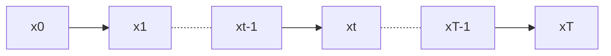

-------------------------

# Denoising Diffusion Probabilistic Models


## 1. Difussion



扩散过程：

- 一个固定过程
- 扩散超参 β

$x_{t-1}\rightarrow x_t$：
$$
x_t= \sqrt{1-\beta_t}x_{t-1}+\sqrt\beta_tz_t,~~~~z_t\sim N(0,I)
$$
$\beta:~10^{-4}\sim2^{-2}$, linear,  $T\approx 2000$

令 $1-\beta_t = \alpha_t$
$$
\begin{align}
x_t &= \sqrt\alpha_tx_t+\sqrt{1-\alpha_t}z_t \notag \\
    &= \sqrt\alpha_t(\sqrt{\alpha_{t-1}}x_{t-2}+\sqrt{1-\alpha_{t-1}}z_{t-1})+\sqrt{1-\alpha_t}z_t \notag \\
\end{align}
$$
根据高斯分布的叠加方法：
$$
x_t=\sqrt{\alpha_t\alpha_{t-1}}x_{t-2}+\sqrt{1-\alpha_t\alpha_{t-1}}z,~~~~z\sim N(0,I) \notag
$$
令 $\bar\alpha_t =  \prod_{i=1}^{T}\alpha_i$，得到 $x_0$ 与 $x_t$ 的关系：
$$
x_t = \sqrt{\bar\alpha_t}x_0+\sqrt{1-\bar\alpha_t}z
$$
如何取β的值？：$\bar\alpha\rightarrow0,~~~~x_T\rightarrow N(0,I)$

> train a  model to fit noise in each steps


-------------------

## 2. Training

假设batch_size = 4，T = 2000


```python
def diffusion_loss_fn(model,x_0,alphas_bar_sqrt,one_minus_alphas_bar_sqrt,n_steps):
    """对任意时刻t进行采样计算loss"""
    batch_size = x_0.shape[0]
    
    #对一个batchsize样本生成随机的时刻t
    t = torch.randint(0,n_steps,size=(batch_size//2,)).to(device)
    t = torch.cat([t,n_steps-1-t],dim=0)
    t = t.unsqueeze(-1)
    
    #x0的系数
    a = alphas_bar_sqrt[t]
    
    #eps的系数
    aml = one_minus_alphas_bar_sqrt[t]
    
    #生成随机噪音eps
    e = torch.randn_like(x_0).to(device)
    
    #构造模型的输入
    x = x_0 * a + e * aml
    
    #送入模型，得到t时刻的随机噪声预测值
    output = model(x,t.squeeze(-1))
    
    #与真实噪声一起计算误差，求平均值
    return (e - output).square().mean()
```


-------------------

## 3. Sampling

根据贝叶斯理论：
$$
q(x_{t-1}|x_t) = \frac{q(x_t,x_{t-1})}{q(x_t)}=\frac{q(x_t|x_{t-1})q(x_{t-1})}{q(x_t)} \notag
$$
目前已知的有：$x_{t-1}\rightarrow x_t$，$x_0 \rightarrow x_t$
$$
\begin{align}
x_t &= \sqrt{\alpha_t}x_{t-1}+\sqrt{1-\alpha_t}z \sim N(\sqrt{\alpha_t}x_{t-1},(1-\alpha_t)I) \longrightarrow q(x_t|x_{t-1})
\notag \\
x_t &= \sqrt{\bar\alpha_t}x_0+\sqrt{1-\bar\alpha_t}z \sim N(\sqrt{\bar\alpha_t}x_0,(1-\bar\alpha_t)I) \longrightarrow q(x_t)
\notag \\
\end{align}
$$

$$
\begin{align}
q(x_t|x_{t-1}) &\sim N(\sqrt{\alpha_t}x_{t-1},(1-\alpha_t)I) \notag \\
q(x_t) &\sim N(\sqrt{\bar\alpha_t}x_0,(1-\bar\alpha_t)I) \notag \\
q(x_{t-1}) &\sim N(\sqrt{\bar\alpha_{t-1}}x_0,(1-\bar\alpha_{t-1})I) \notag
\end{align}
$$

又因为，高斯分布的密度函数可以写成：$N(\mu,\sigma^2)\propto \exp(-\frac{1}{2}\frac{(x-\mu)^2}{\sigma^2})$
$$
\begin{align}
\frac{q(x_t|x_{t-1})q(x_{t-1})}{q(x_t)} &\propto\exp[-\frac{1}{2}(\frac{(x_t-\sqrt\alpha_tx_{t-1})^2}{1-\alpha_t}+\frac{(x_{t-1}-\sqrt{\bar\alpha_{t-1}}x_0)^2}{1-\bar\alpha_{t-1}}-\frac{(x_t-\sqrt{\bar\alpha_t}x_0)^2}{1-\bar\alpha_t})] \notag \\

& \propto \exp\{-\frac{1}{2}[(\frac{\alpha_t}{\beta_t}+\frac{1}{1-\bar\alpha_{t-1}})x_{t-1}^2-2(\frac{\sqrt\alpha_tx_t}{\beta_t}+\frac{\sqrt{\bar\alpha_{t-1}}x_0}{1-\bar\alpha_{t-1}})x_{t-1}]+~ ...    \}  \notag\\

& \propto \exp[-\frac{1}{2}(Ax^2_{t-1}+Bx_t+C)]\notag\\

& \propto \exp[-\frac{1}{2}A(x_{t-1}+\frac{B}{2A})^2+~...] \notag
\end{align}
$$
提取系数，$A = \frac{\alpha_t}{\beta_t}+\frac{1}{1-\bar\alpha_{t-1}}$，$B=-2(\frac{\sqrt\alpha_tx_t}{\beta_t}+\frac{\sqrt{\bar\alpha_{t-1}}x_0}{1-\bar\alpha_{t-1}})$


所以，$\mu = \frac{B}{2A}$，$\sigma^2=\frac{1}{A}$
$$
\begin{align}
\sigma^2 &=\frac{1}{A} \notag \\

&=\frac{1}{\frac{\alpha_t}{\beta_t}+\frac{1}{1-\bar\alpha_{t-1}}} \notag \\
&=\frac{\beta_t(1-\bar\alpha_{t-1})}{1-\alpha_t\bar\alpha_{t-1}} \notag\\
&=\frac{1-\bar\alpha_{t-1}}{1-\bar\alpha_t}\beta_t  
\end{align}
$$

$$
\begin{align}
\mu &= \frac{B}{2A} \notag \\

&=(\frac{\sqrt\alpha_tx_t}{\beta_t}+\frac{\sqrt{\bar\alpha_{t-1}}x_0}{1-\bar\alpha_{t-1}})\frac{1-\bar\alpha_{t-1}}{1-\bar\alpha_t}\beta_t  \notag \\

& =\frac{\sqrt{\alpha_t}x_t(1-\bar\alpha_{t-1})}{1-\bar\alpha_t}+\frac{\sqrt{\bar\alpha_{t-1}}x_0\beta_t}{1-\bar\alpha_t} \notag \\

&= \frac{\sqrt{\alpha_t}(1-\bar\alpha_{t-1})}{1-\bar\alpha_t}x_t+\frac{\sqrt{\bar\alpha_{t-1}}\beta_t}{1-\bar\alpha_t}x_0

\end{align}
$$

因为 $x_t = \sqrt{\alpha_t}x_{t-1}+\sqrt{1-\alpha_t}z$ ，$x_0 = \frac{1}{\sqrt{\bar\alpha_t}}(x_t-\sqrt{1-\bar\alpha_t}\tilde z )$，带入 $\mu$
$$
\begin{align}
\mu&=\frac{\sqrt{\alpha_t}(1-\bar\alpha_{t-1})}{1-\bar\alpha_t}x_t+\frac{\sqrt{\bar\alpha_{t-1}}\beta_t}{1-\bar\alpha_t}\frac{1}{\sqrt{\bar\alpha_t}}(x_t-\sqrt{1-\bar\alpha_t}\tilde z) \notag \\

& =\frac{x_t}{\sqrt{\bar\alpha_t}}(\frac{\alpha_t-\bar\alpha_t+\beta_t}{1-\bar\alpha_t})+\frac{\tilde z}{\sqrt{\alpha_t}}\frac{\beta_t}{\sqrt{1-\bar\alpha_t}} \notag \\

& = \frac{1}{\sqrt\alpha_t}(x_t-\frac{\beta_t}{\sqrt{1-\bar\alpha_t}}\tilde z)

\end{align}
$$


[TOC]
