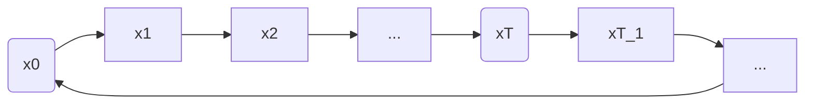

---
tags:
    - 扩散模型
    - 生成模型
    - 理论
    - SDE
---

# SCORE-BASED GENERATIVE MODELING THROUGH STOCHASTIC DIFFERENTIAL EQUATIONS

> [Score-Based Generative Modeling through Stochastic Differential Equations - 馒头and花卷 - 博客园 (cnblogs.com)](https://www.cnblogs.com/MTandHJ/p/16396489.html)

- 扩散模型发展过程中最重要的工作
    - 将之前两类扩散模型进行了理论上的统一
    - 本质还是估计 Score

## 用 SDE 描述扩散模型

$x_t$ 	t 固定 -> 随机变量  $x_t \sim N(\sqrt{\bar\alpha}x_0,(1-\bar\alpha_t)I)$

​		x 固定 -> $x_T,~x_{T-1},...,x_1,x_0$  轨迹（采样）

> $x_t$ 是一个随机过程，所以可以用 SDE 描述

## SDE-based diffusion process

离散过程

$t\in\{0,1,2,...,T\}$

连续过程

$t\in[0,1]$  $x_t \rightarrow x_{t+\Delta t},~~\Delta t \rightarrow0$
$$
dx = \underset{\text{确定性}}{\underbrace{f(x,t)dt}} + \underset{\text{不确定性}}{\underbrace{g(t)dw}}
$$
$f(x,t)$： drift coefficient

$g(t)$：diffusion coefficient

$w$ ：Brownian motion

> 菲克第二定律，郎之万动力学

$$
\begin{align}
x_{t+\Delta t}-x_t &=f(x_t,t)\Delta t + g(t)\sqrt{\Delta t}\varepsilon,~~~~\varepsilon\sim N(0,I) \notag \\

x_{t+\Delta t} &=x_t+f(x_t,t)\Delta t +g(t)\sqrt{\Delta t}\varepsilon \notag \\

p(x_{t+\Delta t}|x_t) &\sim N(x_t+f(x_t,t)\Delta t,g^2(t)\Delta t) \notag \\

x_{t+\Delta t}\rightarrow x_t,~~~ &p(x_t|x_{t+\Delta t}) =\frac{p(x_{t+\Delta t}|x_t)p(x_t)}{p(x_{t+\Delta t})} \notag\\

&= p(x_{t+\Delta t}|x_t)\exp\{\log p(x_t) - \log p(x_{t+\Delta t}) \} \notag \\

\log p(x_{t+\Delta t}) &\approx \log p(x_t)+(x_{t+\Delta t}-x_t) \nabla_{x_t}\log p(x_t)+\Delta t \frac{\partial}{\partial t}\log p(x_t) \notag \\

p(x_t|x_{t+\Delta t}) &=p(x_{t+\Delta t}|x_t)\exp\{-(x_{t+\Delta t}-x_t) \nabla_{x_t}\log p(x_t)-\Delta t \frac{\partial}{\partial t}\log p(x_t) \} \notag \\

&\propto \exp\{\frac{\left \| x_{t+\Delta t}-x_t-f(x_t,t)\Delta t   \right \|^2_2  }{ 2g^2(t)\Delta t }- (x_{t+\Delta t}-x_t) \nabla_{x_t}\log p(x_t)-\Delta t \frac{\partial}{\partial t}\log p(x_t)    \} \notag \\

&=\exp\{-\frac{1}{2g^2(t)\Delta t}(   (x_{t+\Delta t}-x_t)^2- (2f(x_t,t)\Delta t - 2g^2(t)\Delta t\nabla_{x_t}\log p(x_t) )( x_{t+\Delta t}-x_t)) \notag 
\\&-  \Delta t \frac{\partial}{\partial t}\log p(x_t) - \frac{f^2(x_t,t)\Delta t}{2g^2(t)}\} \notag \\

& = \exp \{ -\frac{1}{2g^2(t)\Delta t}\left \| ( x_{t+\Delta t}-x_t) - ( f(x_t,t)- g^2(t)\nabla_{x_t}\log p(x_t))\Delta t    \right \|^2_2 \notag\\
&- \Delta t \frac{\partial}{\partial t}\log p(x_t) - \frac{f^2(x_t,t)\Delta t}{2g^2(t)} + \frac{(f(x_t,t)-g^2(t)\nabla_{x_t}\log p(x_t))^2\Delta t}{2g^2(t)} \} \notag \\

&\Delta t \rightarrow 0,x_{t+\Delta t}\rightarrow x_t \notag\\ 
\approx \exp\{&-\frac{1}{2g^2(t)\Delta t}\left \| ( x_{t+\Delta t}-x_t) - ( f(x_{t+\Delta t},t+\Delta t)- g^2(t+\Delta t)\nabla_{x_{t+\Delta t}}\log p(x_{t+\Delta t}))\Delta t    \right \|^2_2   \} \notag \\

\end{align}
$$

$$
\begin{align}

\notag\\
p(x_t|x_{t+\Delta t}) ~&\text{均值：}              \notag \\
&\text{方差：}                \notag\\
\notag\\
dx &=  [f(x,t)-g^2(t)\nabla_{x_t}\log p(x_t)] + g(t)dw  \notag\\
\text{采样：}x_{t+\Delta t}-x_t &= [f(x_{t+\Delta t},{t+\Delta t})-g^2({t+\Delta t})\nabla_{x_{t+\Delta t}}\log p({t+\Delta t})]\Delta t + g(t+\Delta t)\sqrt{\Delta t}\varepsilon    \notag \\
\end{align}
$$

总结：扩散过程与采样过程
$$
\left\{\begin{align}
&dx = f(x,t)dt + g(t)dw\notag
 \\
&dx = [f(x,t)-g^2(t)\nabla_x\log p(x)]dt + g(t)dw\notag
\end{align}\right.
$$

## 与之前工作的联系

### VE-SDE 

- variance exploding
- NCSN，noise-conditioned score networks
    - $x_t = x_0 +\sigma_t\varepsilon$
    - $x_{t+1}=x_t+\sqrt{\sigma^2_{t+1}-\sigma^2_{t}}\varepsilon$
        - $x_T = x_0 + \sigma_T\varepsilon$
        - $\sigma_T \uparrow$

### VP-SDE

- variance preserving
- DDPM
    - $x_t=\sqrt{\bar\alpha_t}x_0+\sqrt{1-\bar\alpha_t}\varepsilon$
    - $x_{t+1}=\sqrt{1-\beta_{t+1}}x_t+\sqrt{\beta_{t+1}}\varepsilon$
        - $x_T = \sqrt{\bar\alpha_T}x_0+\sqrt{1-\bar\alpha_T}\varepsilon$
        - $\sqrt{\bar\alpha_T} \rightarrow0$

---------------------------

-------------------

$dx = f(x,t)dt + g(t)dw,~~~~x_t\rightarrow x_{t+\Delta t}$

$x_{t+\Delta t}=x_t+f(x_t,t)\Delta t+g(t)\sqrt{\Delta t}\varepsilon$

VE:
$$
\begin{align}
x_{t+\Delta t}&=x_t + \sqrt{\sigma^2_{t+\Delta t}-\sigma^2_{t}}\varepsilon \notag\\
&=x_t + \sqrt{\frac{\sigma^2_{t+\Delta t}-\sigma^2_{t}}{\Delta t}}\sqrt {\Delta t}\varepsilon \notag \\

& = x_t + \sqrt{\frac{d[\sigma^2_t]}{d t}}\sqrt{\Delta t}\varepsilon \notag
\end{align}
$$

- $f(x_t,t)=0, ~~~g(t)=\sqrt{\frac{d[\sigma^2_t]}{d t}}$

VP:
$$
\begin{align}
x_{t+1}&=\sqrt{1-\beta_{t+1}}x_t+\sqrt{\beta_{t+1}}\varepsilon \notag \\

\{\beta_i\}^T_{i=1}, &~~~\text{令} \{\bar\beta_i=T\beta_i \}^T_{i=1} \notag \\

x_{t+1}&=\sqrt{1-\frac{\bar\beta_{t+1}}{T} }x_t+\sqrt{\frac{\bar\beta_{t+1}}{T} }\varepsilon  \notag \\

T\rightarrow \infin,~~&\{\beta_i\}^T_{i=1}\rightarrow\beta(t),t\in[0,1] \notag \\
\beta(\frac{i}{T})=\bar\beta_i,~~&\Delta t = \frac{1}{T} \notag \\

x_{t+\Delta t} &=\sqrt{1-\beta(t+\Delta t)\Delta t}x_t+\sqrt{\beta(t+\Delta t)\Delta t}\varepsilon \notag \\

&\approx (1-\frac{1}{2}\beta(t+\Delta t)\Delta t)x_t + \sqrt{\beta(t+\Delta t)\Delta t}\varepsilon \notag \\

&\approx (1-\frac{1}{2}\beta(t)\Delta t)x_t + \sqrt{\beta(t)\Delta t}\varepsilon  \notag 

\end{align}
$$

- $f(x_t,t) = -\frac{1}{2}\beta(t)\Delta t)x_t$,   $g(t) = \sqrt{\beta(t)}$

> SDE 通过不同的 f()   g()，来实现 NCSN，DDPM

